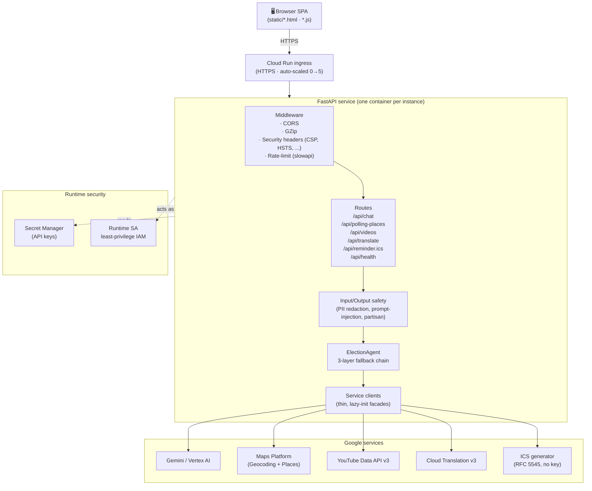
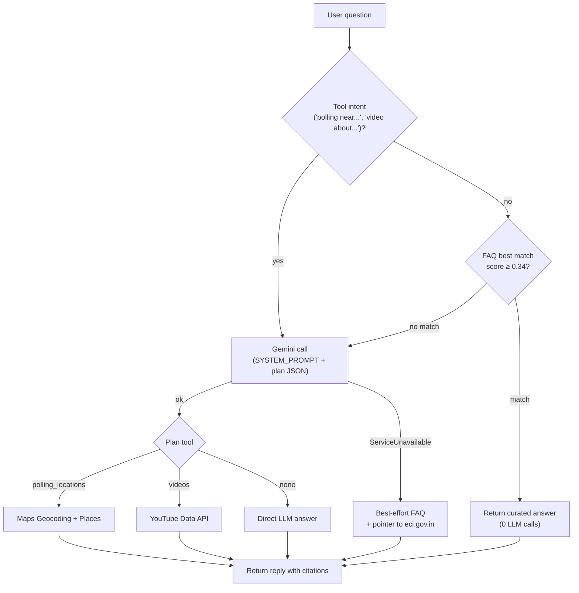

# Architecture

CivicGuide is a small but production-grade FastAPI service that orchestrates
five Google services behind a static single-page UI. The design favours
**clean separation of concerns**, **graceful degradation**, and **defense in
depth** over feature surface area.

## High-level diagram

## Agent decision flow (3-layer fallback)

## Module responsibilities

| Module | Role | Notes |
|---|---|---|
| `app/main.py` | FastAPI app, middleware, routes, lifespan, DI | thin — no business logic |
| `app/agent.py` | Orchestration (FAQ → LLM → tools → fallback) | the brain |
| `app/safety.py` | Input/output content guards | regex-based, framework-free |
| `app/schemas.py` | Pydantic request/response models | the public API contract |
| `app/config.py` | 12-factor settings via `pydantic-settings` | cached, validated once at boot |
| `app/services/gemini.py` | Vertex / AI Studio Gemini facade | swappable backend |
| `app/services/maps.py` | Google Maps (Geocoding + Places) | uses `httpx.AsyncClient` |
| `app/services/youtube.py` | YouTube Data API v3 search | trusted-channel boost |
| `app/services/translate.py` | Cloud Translation v3 | ADC auth, no key |
| `app/services/calendar_ics.py` | RFC 5545 ICS generator | no API needed |
| `app/services/faq.py` | Keyword-overlap FAQ retriever | the fallback floor |
| `app/data/faq.json` | 10 curated election Q&A entries | extend without code change |
| `static/index.html` | Accessible SPA shell | semantic + ARIA |
| `static/app.js` | Vanilla-JS client | no build step |

## Why these design choices?

### Why a static SPA over a SSR / React app?
- Zero build step → trivial Cloud Run image
- ~10 KB total JS payload → instant load
- Easier to audit for security & accessibility

### Why ICS over Google Calendar OAuth?
- Avoids OAuth-consent-screen friction
- Works for users without Google accounts
- One-line `.ics` works in Google Calendar, Apple, Outlook

### Why Vertex AI as default LLM backend?
- Application Default Credentials → no key in env / image
- Works around the consumer-API `limit: 0` org policy issue
- Same `GenerativeModel` API surface as AI Studio (clean swap)

### Why an FAQ-first fallback chain?
- Election questions cluster around ~10 topics; deterministic answers are
  faster, cheaper, and *always available*
- Demonstrates "logical decision making based on user context"
- Keeps the demo functional even if the LLM is rate-limited / blocked

### Why per-IP rate limiting (slowapi) instead of API gateway?
- Single small service; no API gateway complexity needed
- 30 req/min/IP is enough for a demo; tightening is one env-var change

## Request lifecycle (chat)

1. Browser POSTs `/api/chat` over HTTPS → Cloud Run ingress
2. CORS / GZip / security-headers middleware run
3. `slowapi` checks per-IP rate limit
4. Pydantic validates the body
5. `safety.check_input` strips PII + blocks injection / partisan
6. `ElectionAgent.respond` chooses path (FAQ ↔ LLM ↔ tools)
7. `safety.check_output` final-pass
8. Response serialised to JSON; GZip-compressed if > 1 KB
9. Browser renders Markdown → DOM (with `escapeHtml` first)

## Failure modes & how we handle them

| Failure | Handling |
|---|---|
| Gemini quota / org block | FAQ fallback (no degradation for top 10 questions); graceful pointer for others |
| Maps key invalid | `ServiceUnavailable` → 503 to client → friendly message in UI |
| YouTube 403 | Same — service-level isolation prevents cascading failure |
| Cold start | `min-instances=0` saves money; first request adds ~1 s; UI shows typing indicator |
| Pod OOM | `concurrency=40` + 512 MiB → tested headroom for tool routing + Markdown |
| Secret rotated | Cloud Run picks up `:latest` automatically on next request |
